# Athletic Sales Analysis

## Overview:
This program is used to analyze sales data to gain insights into which US cities have sold the most athletic wear over two year period. It will also dtermine which retailer had the highest total sales for athletic wear, and which retailers sold the most women's athletic footwear. Finally it determine which day and week had the highest sales for women's athletic footwear. 

## Technical Details:
- This program will use pandas framework to read data files, cleanup to prepare for further analysis
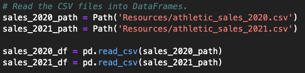
- Multiple source table data will be used to create dataframe using ```pd.concat``` 
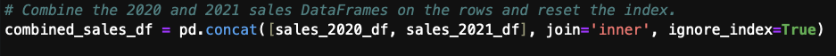
- Invoice Date field datatype will changed from [*object*] to [*datetime*] type using pandas function ```pd.to_datetime``` 

### Region / Retailer who Sold the Most Products / Sales Amount
- Use either the ```groupby``` or ```pivot_table``` function to create a multi-index DataFrame  
- ```agg``` or ```aggfunc`` function is used to aggregate data for the required data columns
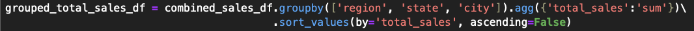

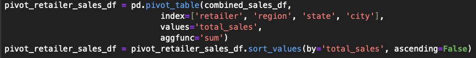
- ```sort_values``` function is used to sort data frame by required column
- ```rename``` function is used to rename column names
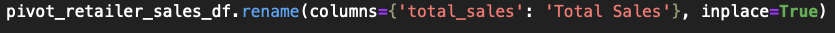
- It will show which Region or Retailer had the Most Sales

### Sales by Retailer for the most "Women's Athletic Footwear"
- Using product category "Women's Athletic Footwear" values another data frame will be created to represent the subset of data
- Again use either the ```groupby``` or ```pivot_table``` function to create a multi-index DataFrame for women's athletic footwear dataset
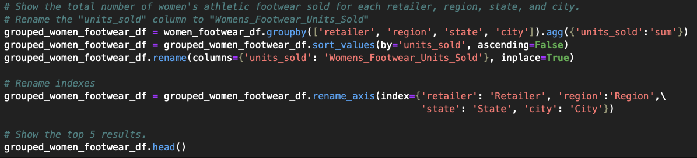

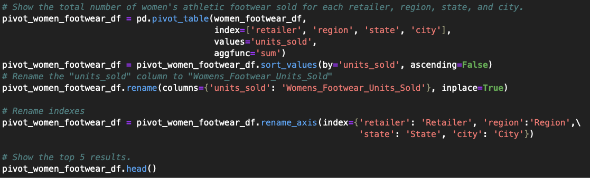
- It will show the total number of women's athletic footwear sold for each retailer, region, state, and city.

### Sales by Day/Week with the Most Women's Athletic Footwear Sales
- It then will determine the Day with the Most Women's Athletic Footwear Sales by creating ```pivot_table``` for 'Invoice Date' column
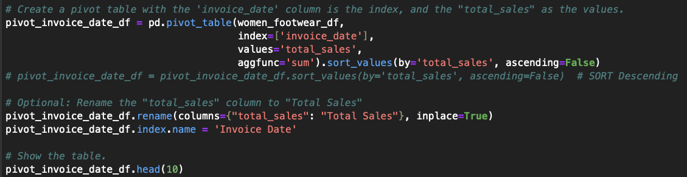
- ```resample``` technique is used on the pivot table to create daily/weekly bins, and get the total sales for each day or week.
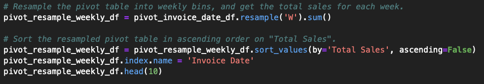

## Results:

### Top five regions that had the most products
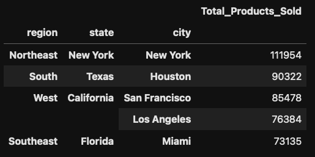

### Top five regions that had the most sales
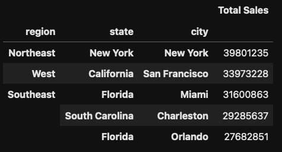

### Top five retails who had the most sales 
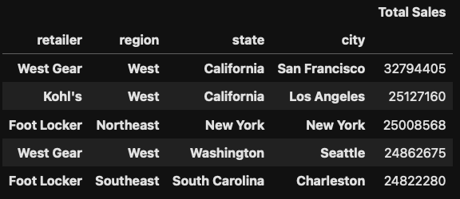

### Top five Retailer who Sold the Most Women's Athletic Footwear
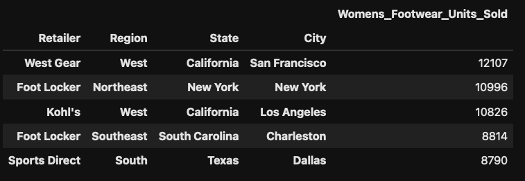

### Top ten days with the Most Women's Athletic Footwear Sales
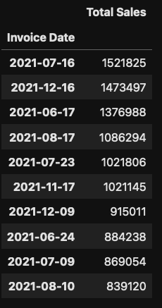

### Top ten Weeks with the Most Women's Athletic Footwear Sales
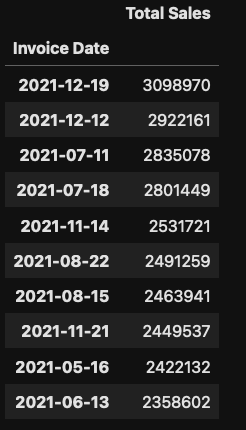

